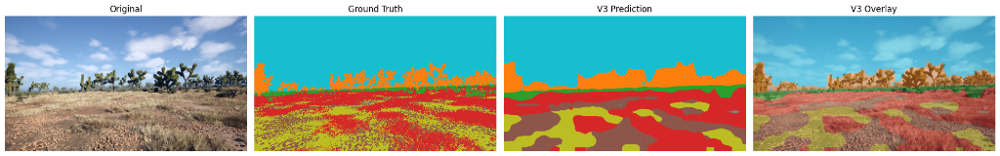
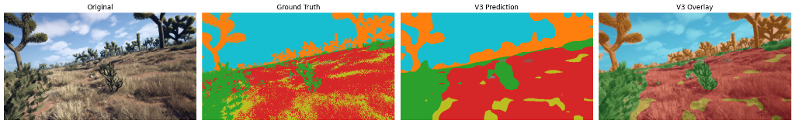
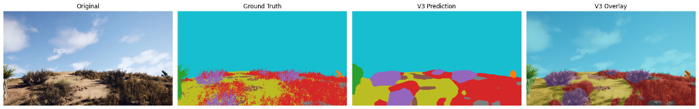

# ROVER — Visual Perception & Traversability System for UGVs

ROVER is a visual perception and traversability estimation subsystem designed for Unmanned Ground Vehicles (UGVs) operating in complex, off-road environments.

---

## 1. Overview

UGVs must navigate unpredictable paths, rocks, logs, and vegetation without relying on GPS. ROVER solves the vision-based scene interpretation challenge. The system takes a single camera image as input, extracts rich semantic features, estimates local ground traversability, and recommends a safe driving corridor.



*The four-panel comparison above demonstrates the original image, ground truth labels, predicted segmentation classes, and overlaid alpha blend produced by the ROVER V3 perception head on a typical off-road scene.*

### Purpose and Scope
ROVER is a **perception and traversability reasoning module**. It is not a complete autonomous vehicle stack. It processes camera data to recommend safe paths, which can then be ingested by local vehicle motion controllers and path executors.

---

## 2. Problem Statement Context

* **Problem Statement ID**: 26126
* **Official Title**: Vision Based Autonomous Navigation for Unmanned Ground Vehicle for Outdoor environment
* **Category**: Smart India Hackathon (SIH)

### The Visual Perception Challenge
Outdoor off-road environments present unpredictable terrain, changing light, and unstructured routes. Standard navigation systems fail in unstructured environments without lane lines or clear pavement. To navigate safely, a ground vehicle must rely on local camera perception to distinguish drivable terrain from natural hazards (rocks, logs, trees) in real time. ROVER implements this critical perception and traversability estimation layer.

> [!IMPORTANT]
> **Scope Note**: ROVER focuses specifically on the **Perception and Traversability** portion of the problem. Low-level vehicle control, visual odometry, and closed-loop visual SLAM are outside the scope of this implementation and are left for integration with dedicated navigation frameworks.

---

## 3. The Processing Pipeline

ROVER translates raw camera pixels into a driving status using a multi-stage software pipeline:

1. **Camera Image**: Receives a single $476 \times 266$ RGB image from the UGV's forward-facing camera.
2. **DINOv2 Feature Extraction**: Passes the preprocessed image through a frozen vision transformer backbone to extract high-dimensional patch features.
3. **ROVER V3 Segmentation Head**: Predicts a class logit tensor using a custom multi-layer convolutional decoder.
4. **10-Class Semantic Segmentation**: Assigns a terrain class index (0–9) to every pixel in the image.
5. **Runtime Hazard Refinement**: Applies geometrical and visual color filters to refine raw Log and Rock predictions.
6. **Physical Traversability Estimation**: Converts refined semantic classes and prediction confidences into a physical drivability score map.
7. **Safety Buffer Allocation**: Expands hard hazard boundaries outward using morphological operations to prevent the vehicle from driving too close to obstacles.
8. **Safe Corridor Search**: Scans the lower ground region to locate a lane width of 90 pixels with the highest safety score.
9. **UGV Navigation Recommendation**: Outputs a visual path overlay and status label (`SAFE`, `CAUTION`, or `BLOCKED`).

---

## 4. Why Semantic Segmentation?

Traditional computer vision uses bounding boxes to detect objects. While bounding boxes tell a vehicle *where* an obstacle is, they do not define the exact boundaries of the traversable ground.

```
Bounding Box Detection (Object detection)  ──► "There is a rock somewhere in this rectangle."
Pixel-Level Class Labels (Segmentation)    ──► "These exact pixels are rock; these adjacent pixels are dirt road."
```

Semantic segmentation classifies every individual pixel in the image. This detail is essential for off-road driving, where the boundary between a sandy trail, low grass, and a large boulder determines if a vehicle will get stuck.

### Key Computer Vision Distinctions
* **Classification**: Predicts a single label for the entire image (e.g., "Forest scene").
* **Object Detection**: Draws rectangular bounding boxes around individual objects (e.g., "Rock at location X, Y").
* **Semantic Segmentation**: Assigns a category label to every pixel, defining exact shapes and terrain boundaries.
* **Traversability Estimation**: Evaluates segmented terrain pixels to decide if they are physically drivable.

---

## 5. Deep Learning Architecture

ROVER V3 uses a hybrid architecture combining a transformer backbone with a custom convolutional segmentation head.

```
   Input Image (476x266)
           │
           ▼
  DINOv2 ViT-S/14 (Frozen)  ──► Extracts 646 patch tokens (384-dim features)
           │
           ▼
   Reshape to 19x34
           │
           ▼
 ROVER V3 Head (Trainable)  ──► 3-layer ConvDecoder resolves upsampled 10-class map
```

### Transformer Backbone (DINOv2 ViT-S/14)
The system uses Meta's DINOv2 (Vision Transformer, Small, patch size 14) as a frozen feature extractor. DINOv2 converts the input image into a grid of feature patches:
* **Frozen weights**: The backbone is not retrained. Freezing the transformer preserves its pretrained visual representations and reduces the training footprint, making it ideal for smaller datasets.
* **Feature Grid**: An input of $476 \times 266$ is divided into patches of $14 \times 14$ pixels. This produces a patch grid of $19 \times 34 = 646$ tokens.
* **Dimension**: Each token is represented by a 384-dimensional feature vector.

### Custom ROVER V3 Segmentation Head
The segmentation head acts as a decoder. It reshapes the 646 patch tokens from a flat sequence back into a spatial feature map of size $19 \times 34 \times 384$. It then upsamples and decodes the features using three convolutional layers:
1. **Layer 1**: Conv2D ($384 \to 128$ channels, $3 \times 3$ kernel, padding 1) + GELU activation.
2. **Layer 2**: Conv2D ($128 \to 128$ channels, $3 \times 3$ kernel, padding 1) + GELU activation.
3. **Layer 3 (Classifier)**: Conv2D ($128 \to 10$ channels, $1 \times 1$ kernel) to output class logits.

---

## 6. Training Strategy

The custom segmentation head was trained on the Duality off-road dataset using Colab.

### Training Configuration
* **Optimizer**: AdamW (Learning Rate: `1e-3`, Weight Decay: `1e-4`)
* **Learning Rate Scheduler**: `ReduceLROnPlateau` (updates learning rate by a factor of 0.5 if validation loss does not improve for 3 consecutive epochs).
* **Batch Size**: 8
* **Epochs**: 30
* **Random Seed**: 42 (for reproducibility of data splits and weight initialization)
* **Target Resolution**: All training images were resized to $476 \times 266$ and normalized to match the DINOv2 pretraining distribution.

### Loss Function: Combined Weighted Loss
Off-road datasets are highly imbalanced. Common classes like Landscape (dirt road) and Sky contain millions of pixels, while critical hazards like Logs and Rocks make up a tiny fraction of the dataset. A model trained on standard cross-entropy might achieve high overall accuracy by ignoring the rare hazard classes.

To address this, ROVER V3 uses a combined loss function:
$$\text{Total Loss} = 0.5 \times \text{Weighted Cross Entropy} + 0.5 \times \text{Weighted Focal Loss}$$

* **Weighted Cross Entropy**: Applies scaling factors (inverse frequency weights) to penalize errors on rare classes more heavily.
* **Weighted Focal Loss ($\gamma = 2.0$)**: Adds a modulating factor $(1 - p_t)^\gamma$ to standard cross entropy. As the model's confidence in a pixel increases, the loss contribution drops. This prevents easy, common pixels (like Sky) from dominating the gradients, forcing the model to focus on learning difficult boundaries (like Logs and Ground Clutter).

#### Why combine them?
* **Weighted Cross Entropy** ensures rare but important classes such as Logs and Rocks receive sufficient training emphasis.
* **Focal Loss** reduces the influence of easy, already-correct pixels and focuses learning on difficult pixels and boundaries.
* Combining both gives the segmentation head pressure to learn rare hazards without completely ignoring the dominant terrain classes.

---

## 7. Key Technical Terms

Understanding the underlying technology helps clarify how ROVER performs visual scene layout reasoning:

### DINOv2
A pretrained Vision Transformer model trained by Meta using self-supervised learning. In this project, it is used as a frozen feature extractor that converts raw camera pixels into dense, high-dimensional visual feature vectors.

### Vision Transformer (ViT)
An alternative neural network architecture to conventional Convolutional Neural Networks (CNNs). Instead of scanning the entire image with sliding convolutional kernels, a ViT splits the image into a sequence of small patches and uses self-attention mechanisms to learn global context.

### Patch Token
Each individual image patch processed by a ViT. In ROVER, the input is divided into $14 \times 14$ pixel patches, forming a $19 \times 34$ grid of 646 patch tokens. Each token represents local spatial information as a 384-dimensional vector.

### Segmentation Head
A lightweight convolutional decoder trained specifically to map the high-dimensional feature grids back into spatial probability masks matching the original image dimensions.

### Logit
The raw, unnormalized prediction scores output by the final classification layer. These numerical values are converted into probabilities ($0.0$ to $1.0$) using the softmax function.

### Semantic Segmentation
The process of assigning a semantic category label to every pixel in an image, allowing fine-grained classification of shapes, trails, and complex background boundaries.

### Intersection over Union (IoU)
An evaluation metric calculating the overlap percentage between the predicted region and the actual ground-truth region.

### Mean IoU (mIoU)
The average of the IoU scores computed across all semantic classes, ensuring that large, common classes do not hide poor detection performance on smaller, rare hazard classes.

### Dice Score
A spatial overlap metric measuring prediction and ground truth agreement. It is mathematically equivalent to the F1 score.

### Focal Loss
An improvement over standard Cross Entropy that down-weights easy, well-classified background pixels, forcing the network's gradient updates to prioritize learning difficult, ambiguous boundaries.

### Traversability
An engineering score defining how safe or physically drivable a specific region of ground is for a ground vehicle, considering terrain type, slope, and obstacle buffers.

### Morphological Dilation
A computer vision operation that expands the boundaries of a binary mask. ROVER uses dilation to pad hard obstacle contours, creating safe safety zones.

### Safe Corridor
The selected driving path column in front of the vehicle that maximizes terrain drivability scores while maintaining zero occupancy of hard hazard regions.

---

## 8. Dataset Details

The system was trained on the **Duality off-road dataset**, which consists of synthetic off-road sensor imagery.
* **Benefits**: Provides pixel-perfect ground truth labels for complex categories like Ground Clutter and Logs, which are difficult and time-consuming to label manually.
* **Generalization**: Synthetic training allows the model to learn structural and geometric cues. However, a synthetic-to-real domain gap remains, meaning performance can vary under real-world lighting, dust, and weather conditions.
* **Dataset Documentation**: [Duality Falcon — Hackathon Segmentation Documentation](https://falcon.duality.ai/secure/documentation/hackathon-segmentation-desert?utm_source=hackathon&utm_medium=instructions&utm_campaign=HacktheNight)


---

## 9. Semantic Classes & Traversability Mapping

Each of the 10 predicted classes is mapped to a physical drivability category:



*The sloped path comparison above illustrates prediction consistency when handling tilted camera axes, successfully isolating dry grass and trees.*

| Class ID | Class Name | Traversability Mapping | Drivability Score | Description |
| :---: | :--- | :--- | :---: | :--- |
| **0** | Background | **Invalid** | 0.0 | Non-ground elements, scenery, or out-of-bounds pixels. |
| **1** | Trees | **Invalid** | 0.0 | Vertically standing trunks and branches; non-drivable. |
| **2** | Lush Bushes | **Caution** | 0.4 | Thick green vegetation; traversable but slow, potential hidden hazards. |
| **3** | Dry Grass | **Preferred** | 0.9 | Dry grassy patches; easily traversable by standard UGVs. |
| **4** | Dry Bushes | **Caution** | 0.4 | Dead or dry brushwood structures; caution required. |
| **5** | Ground Clutter | **Caution** | 0.2 | Twigs, leaves, and forest debris; low drivability confidence. |
| **6** | Logs | **Hazard** | -1.0 | Fallen wooden logs; high risk of high-centering. |
| **7** | Rocks | **Hazard** | -1.0 | Medium to large rocks; risk of collision or tire puncture. |
| **8** | Landscape | **Preferred** | 1.0 / 0.95 | Sandy dirt road, gravel tracks, or open dirt paths. |
| **9** | Sky | **Invalid** | 0.0 | Unreachable vertical regions. |

---

## 10. Evaluation Metrics

To evaluate model accuracy, ROVER V3 uses standard semantic segmentation metrics:

### Intersection over Union (IoU)
IoU measures the overlap between the predicted region and the ground-truth region:
$$\text{IoU} = \frac{\text{Prediction} \cap \text{Ground Truth}}{\text{Prediction} \cup \text{Ground Truth}}$$
* Think of IoU as asking: how much does the predicted region overlap the actual region? If they match perfectly, the score is 1.0; if they do not overlap, it approaches 0.0.

### Dice Score (F1-like metric)
The Dice coefficient measures spatial overlap, focusing on the ratio of correct predictions to the total area:
$$\text{Dice} = \frac{2 \times |\text{Prediction} \cap \text{Ground Truth}|}{|\text{Prediction}| + |\text{Ground Truth}|}$$
* Dice also measures overlap, but weights the shared region differently and is closely related to the F1 score.

### Pixel Accuracy
Calculates the percentage of correctly classified pixels across the entire image.
* Accuracy measures how many individual pixels received the correct class.

> [!IMPORTANT]
> **mIoU** is the primary segmentation metric used here because pixel accuracy can look high even when small but important hazard classes (such as Logs or Rocks) are poorly detected.

### Verified Validation Results (ROVER V3)
* **Validation mIoU**: 51.90%
* **Validation Dice**: 65.83%
* **Validation Accuracy**: 81.29%

#### Per-Class IoU Results
* **Sky**: 0.9622
* **Trees**: 0.7066
* **Dry Grass**: 0.6115
* **Lush Bushes**: 0.6059
* **Landscape**: 0.5775
* **Background**: 0.5085
* **Dry Bushes**: 0.3894
* **Rocks**: 0.3320
* **Logs**: 0.2570
* **Ground Clutter**: 0.2392

The relatively lower IoU of Logs (0.257) and Rocks (0.332) indicates that these classes remain more difficult for the segmentation model. ROVER therefore applies a separate runtime hazard-refinement stage before converting predictions into traversability.

---

## 11. Why Segmentation Alone Is Not Enough

A segmentation model answers the question: *"What does this pixel look like?"*
ROVER's refinement layer answers the question: *"Is this pixel actually an obstacle?"*

* **Semantic segmentation $\neq$ traversability**: Landscape pixels are likely traversable, grass is preferred, bushes denote caution, while rocks and logs are absolute hazards. Sky and trees are completely invalid. This context necessitates a physical reasoning layer.

---

## 12. Runtime Hazard Refinement

The segmentation network can confuse visually similar off-road elements (such as dirt vs. rocks, or logs vs. soil). At runtime, ROVER applies additional geometric and visual color filters to verify hard hazards before they are sent to the path planner. These heuristics run on the CPU during the post-processing phase. The neural network weights remain unchanged.

### Log Refinement
Fallen trees are often misclassified as sand or grass due to color similarities. ROVER verifies log candidates using a multi-signal confidence equation:
$$\text{Log Confidence} = 0.50 \times \text{Log Prob} + 0.20 \times \text{Elongation} + 0.15 \times \text{Edge Continuity} + 0.15 \times \text{Wood Color}$$
* **V3 Probability Gate**: Candidates are skipped if the peak V3 log probability in the component is $< 0.15$.
* **Shape & Color**: Evaluates connected components for elongated geometry (aspect ratio $\ge 1.8$), thin profile, and a wood-like color signature ($R > G > B$). This prevents large, brown, sandy road surfaces from being flagged as logs.
* **Promotion**: Components $\ge 150$ px with confidence $\ge 0.70$ are promoted to **Hard Log**. Lower scores are classified as **Low-Confidence Log**.

### Rock Refinement
Loose rocks are verified using solidity and edge density:
$$\text{Rock Confidence} = 0.50 \times \text{Rock Prob} + 0.25 \times \text{Solidity} + 0.25 \times \text{Edge Density}$$
* Candidates must have a peak Rock probability $\ge 0.15$.
* Compact, high-density components $\ge 150$ px with confidence $\ge 0.70$ are promoted to **Hard Rock**. Otherwise, they are classified as **Low-Confidence Rock**.

---

## 13. Spatial Safety Buffers

UGVs should not drive immediately beside detected rocks or logs to avoid side collisions. ROVER creates a spatial buffer around confirmed Hard Hazards.
* **Morphological Dilation**: The hard hazard mask is expanded using a $15 \times 15$ elliptical kernel (`cv2.dilate`). This creates a safety boundary that follows the object's contours.
* **Penalty**: Pixels inside the buffer zone receive a 70% traversability score reduction, steering the corridor planner away from obstacle edges.

---

## 14. Safe Corridor Estimation

The path planner estimates a recommended corridor in the lower 45% of the frame (representing the ground plane immediately in front of the vehicle):
1. **Lanes**: Scans horizontal windows of width 90 pixels across the image.
2. **Scoring**: Computes the average traversability score for each window. Columns containing non-drivable classes (Trees/Background) or safety buffers receive penalties.
3. **Hard Obstacles**: Only Hard obstacles (not low-confidence hazards) can block the corridor.
4. **Status Outputs**:
   * **`SAFE`**: Clear path corridor found with high drivability and zero hard hazard occupancy.
   * **`CAUTION`**: Lane selected but contains low-confidence hazards or is close to obstacle buffers.
   * **`BLOCKED`**: No safe corridor exists. The selected lane contains a hard hazard (hazard occupancy $\ge 40$ pixels).

*Note: This is a visual corridor recommendation layer and does not calculate real motor control signals.*

---

## 15. ROVER Telemetry Cockpit

The web interface serves as a diagnostic console:

* **Raw Prediction Mode**: Renders the exact 10-class predictions generated by the ROVER V3 model.
* **Traversability Mode**: Renders BGR-coded drivability maps (Green for Traversable, Yellow for Caution, Red for Hard Hazards, Gray for Sky/Trees) blended at 20% opacity.
* **Telemetry Statistics**: Displays UGV status (`SAFE` / `CAUTION` / `BLOCKED`), Traversability Index, obstacle count, rock/log area percentages, processing latency, and static Validation mIoU (`51.9%`).
* **Visual Annotations**: Shows perspective lane overlays, dashed blocked corridors, and bounding outlines for Hard hazards.

---

## 16. Demo Verification Scenarios

The system was evaluated against three distinct off-road path scenarios:

### SAFE: Clear open dirt road (`test_safe.jpg`)
* **UGV Status**: `SAFE`
* **Raw Rock/Log Area**: Rock 0.29%, Log 0.01%
* **Refined Hard Hazards**: Rock `0 px`, Log `0 px` (Successful false-positive filtering)
* **Traversability Index**: `81%`
* **Recommended Corridor**: Lane centered at $x \in [239, 329]$ with score `0.900`.

### CAUTION: Obstructed trail (`test_caution.jpg`)
* **UGV Status**: `SAFE` (Corridor avoids all obstacles)
* **Raw Rock/Log Area**: Rock 7.20%, Log 0.09%
* **Refined Hard Hazards**: Rock `8665 px`, Log `0 px`
* **Traversability Index**: `24%`
* **Recommended Corridor**: Lane offset to the left edge at $x \in [32, 122]$ with score `0.678`.

### BLOCKED: Obstacles blocking path center (`test_blocked.jpg`)
* **UGV Status**: `BLOCKED`
* **Raw Rock/Log Area**: Rock 8.12%, Log 0.65%
* **Refined Hard Hazards**: Rock `9602 px`, Log `10474 px` (True logs detected)
* **Traversability Index**: `3%`
* **Recommended Corridor**: Marked red and dashed; no safe path available (score `0.0`).

---

## 17. Technology Stack

* **Backend**: Python, PyTorch, DINOv2, FastAPI, OpenCV, torchvision
* **Frontend**: HTML, CSS, JavaScript

---

## 18. Repository Structure

```
ROVER-SIH26126/
│
├── assets/
│   ├── segmentation_comparison_1.png   # Hero comparison (Original / GT / Prediction / Overlay)
│   ├── segmentation_comparison_2.png   # Sloped path segmentation example
│   └── segmentation_comparison_3.png   # Uphill rocky segmentation example
│
├── rover_v3.ipynb                      # Training notebook & architecture source of truth
├── best_rover_v3_segmentation_head.pth # Saved weights for the custom segmentation head
│
├── api.py                              # FastAPI backend serving inference and telemetry
├── diagnostic_interface.html           # HTML/JS/CSS telemetry dashboard UI
│
├── requirements.txt                    # Python package dependencies
├── .gitignore                          # Git patterns to ignore
└── .gitattributes                       # Git attributes definition
```

* [assets/segmentation_comparison_3.png](assets/segmentation_comparison_3.png) is shown below, demonstrating a rocky path and vegetation classification:



* [rover_v3.ipynb](rover_v3.ipynb): Training notebook containing frozen DINOv2 setup, combined Focal Loss code, and learning curves.
* [best_rover_v3_segmentation_head.pth](best_rover_v3_segmentation_head.pth): Fine-tuned classifier weights.
* [api.py](api.py): FastAPI server containing the post-processing filters, buffer logic, and lane planner.
* [diagnostic_interface.html](diagnostic_interface.html): Web client for uploading images, rendering overlays, and displaying telemetry.

---

## 19. Getting Started

### Prerequisites
Ensure Python 3.9+ is installed on your system.

### Installation

1. **Clone the repository**:
   ```bash
   git clone <repository-url>
   cd ROVER-SIH26126
   ```

2. **Create and activate a virtual environment**:
   * Windows:
     ```powershell
     python -m venv .venv
     .venv\Scripts\Activate.ps1
     ```
   * Linux/macOS:
     ```bash
     python3 -m venv .venv
     source .venv/bin/activate
     ```

3. **Install dependencies**:
   ```bash
   pip install -r requirements.txt
   ```

4. **Start the FastAPI server**:
   ```bash
   python api.py
   ```
   *Note: On first run, PyTorch will download the DINOv2 ViT-S/14 weights from the torch.hub repository and cache them locally in `~/.cache/torch/hub`.*

5. **Open the Dashboard**:
   Open your browser and navigate to `http://127.0.0.1:8000`.

6. **Upload and Scan**:
   Select an off-road image to view the raw segmentation mask and traversability overlays.

---

## 20. Limitations

* **Camera-Only Input**: The system lacks radar, LiDAR, or depth integration. Traversability scores assume flat ground.
* **Synthetic Training Bias**: The model was trained on synthetic datasets. Real-world outdoor conditions (dust, rain, or glare) will introduce domain-shift errors.
* **No Temporal Consistency**: Predictions are evaluated frame-by-frame. Obstacles are not tracked between consecutive frames.
* **Inference Latency**: Current development-time inference measurements are approximately 400–560 ms depending on the scenario and runtime conditions.
* **Subsystem Design**: The module does not calculate steering commands or track vehicle odometry. It must be paired with low-level motion planning and control systems.

---

## 21. Project Scope

A summary of ROVER's features:

```
[Implemented Subsystems]
  ✓ Visual terrain segmentation (10 classes)
  ✓ Custom convolutional segmentation head
  ✓ Multi-signal hazard refinement (Log/Rock filters)
  ✓ Contingency safety buffering (Morphological dilation)
  ✓ Safe corridor search & recommendation (SAFE/CAUTION/BLOCKED status)
  ✓ Interactive diagnostic cockpit UI

[Excluded Subsystems]
  ✗ Visual SLAM / Odometry
  ✗ GPS-free visual localization
  ✗ Dynamic vehicle path execution (Wheel/Motor controls)
```
